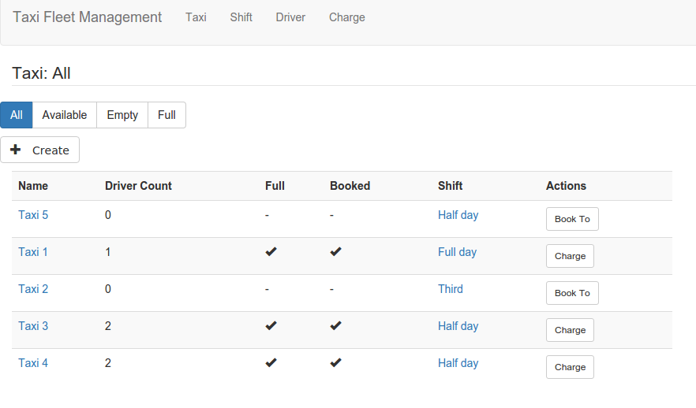
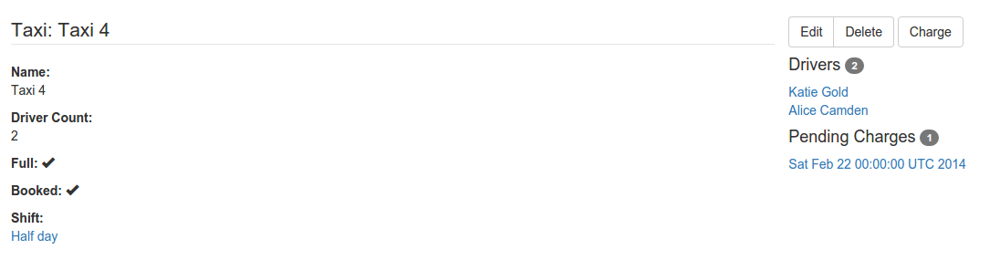
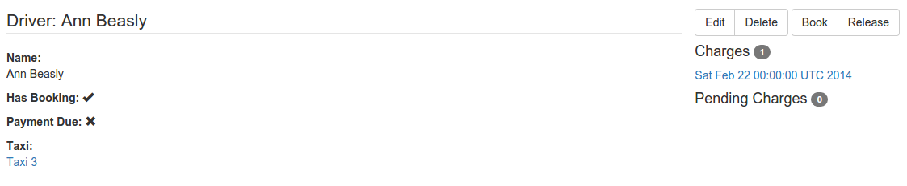
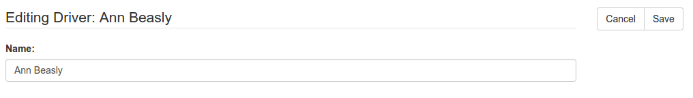
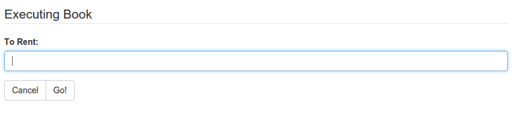
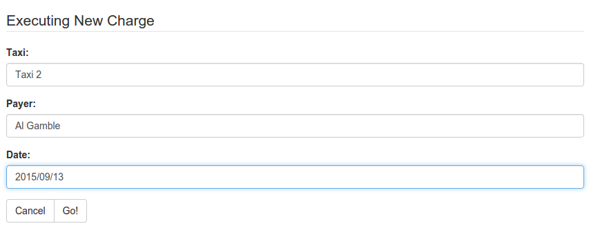
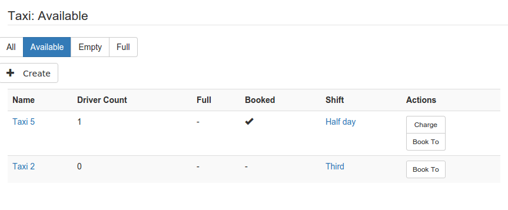
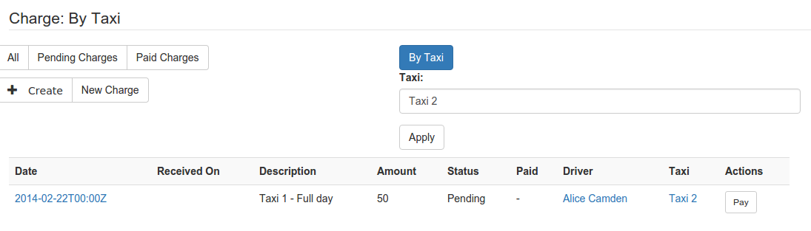

# kirra-ui

**kirra-ui** is a collection of generic clients for applications that expose their domain model as a [Kirra-compliant](///github.com/abstratt/kirra/blob/master/readme.md) REST API. 

## kirra-angular

**kirra-angular** is a kirra-ui implementation, based on HTML5/JavaScript(Angular). 

kirra-angular provides a generic Angular admin application that renders a UI dynamically based on the 
application schema that is discovered using the back-end (Kirra-based) REST API. 

kirra-angular is not limited to basic CRUD. Besides basic UI elements for CRUD, kirra-angular also exposes actions and queries, typical in richer domain models.

### How to use

For Kirra-based APIs, no custom code has to be written to produce a kirra-angular-based UI. Just publish it to a static web server,
and load it on the browser pointing it to your application back-end using the app-path or app-uri query parameters:

```
http://myserver.org/kirra-angular?app-uri=<my-kirra-application-uri>
```

See URIs for the live demos below.

For non-Kirra-based APIs, depending on how rich your API is, you should be able to plug a custom angular service to map
between the Kirra-based format and your application's format.

### Live demos

#### Cloudfier-based prototypes
This is still in early development, many features are missing. You can try it out against any [Cloudfier](http://cloudfier.com)-based application using URLs like these:

* [Taxi Fleet](http://develop.cloudfier.com/kirra-api/kirra-ng/?app-uri=http://develop.cloudfier.com/services/api-v2/test-cloudfier-examples-taxi-fleet)
* [Car Service](http://develop.cloudfier.com/kirra-api/kirra-ng/?app-uri=http://develop.cloudfier.com/services/api-v2/test-cloudfier-examples-carserv)
* [Car rental](http://develop.cloudfier.com/kirra-api/kirra-ng/?app-uri=http://develop.cloudfier.com/services/api-v2/test-cloudfier-examples-car-rental)
* [Expenses](http://develop.cloudfier.com/kirra-api/kirra-ng/?app-uri=http://develop.cloudfier.com/services/api-v2/test-cloudfier-examples-expenses)
* [Ship It](http://develop.cloudfier.com/kirra-api/kirra-ng/?app-uri=http://develop.cloudfier.com/services/api-v2/test-cloudfier-examples-shipit)

#### Example Java EE applications

* [Example 1](http://develop.cloudfier.com/kirra-api/kirra-ng/?app-uri=http://examples-abstratt.rhcloud.com)
* [Example 2](http://develop.cloudfier.com/kirra-api/kirra-ng/?app-uri=http://examples2-abstratt.rhcloud.com)

These Java EE apps were fully generated from Cloudfier applications (no handwritten code) but look like typical standalone code you would write by hand. See code for all generated Java EE apps [here](https://textuml.ci.cloudbees.com/job/codegen-examples-JEE/ws/jee/).

### Video

This video shows kirra-angular in action:

[](https://www.youtube.com/watch?v=twHCj-WddB8&t=117)

### Screenshots  

##### Navigation and list views

For each top-level entity defined in the application, a menu entry is rendered at the top of the screen.
This menu entry takes the user to the list view for the corresponding entity.

The list view is a table showing (by default) all instances of that entity, with no filtering.



##### Details and edit views

From a list view, you can open the details for any of the instances.
The details view shows the basic data, child objects, relationships
and any (instance-level) actions available.  





From the detail view, you can open the edit view to edit the instance details.  




##### Instance actions

 When an entity describes instance actions, they are triggerable from the details view, 
 and from the list view. 



##### Entity actions

When an entity defines an entity-level action (a.k.a. static operation), the actions are exposed in the list view.

 


##### Filtering

Entities may define queries, which are also exposed in the list UI. 



When a query prescribes parameters, users must provide them before the query can be executed. 



### License

kirra-angular is distributed under the Eclipse Public License. 

### Dependencies

kirra-angular requires angular, bootstrap, angular-bootstrap and angular-ui-router.

